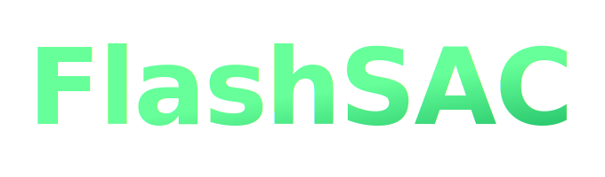

<h1></h1>

Official implementation of 
**FlashSAC: Fast and Stable Off-Policy Reinforcement Learning for High-Dimensional Robot Control**

[](https://holiday-robot.github.io/FlashSAC/)
[](docs/pdf/arXiv26_flashsac.pdf)

> [Donghu Kim](https://i-am-proto.github.io/)\*<sup>1</sup>, [Youngdo Lee](https://leeyngdo.github.io/)\*<sup>2,3</sup>, [Minho Park](https://pmh9960.github.io/)<sup>2</sup>, [Kinam Kim](https://kinam0252.github.io/)<sup>2</sup>, [Takuma Seno](https://takuseno.github.io/)<sup>4</sup>, [I Made Aswin Nahrendra](https://anahrendra.github.io/)<sup>3</sup>, [Sehee Min](https://seiing.github.io/)<sup>1</sup>, [Daniel Palenicek](https://www.linkedin.com/in/danielpalenicek/)<sup>5,6</sup>, [Florian Vogt](https://scholar.google.com/citations?user=PvEf33EAAAAJ)<sup>7</sup>, [Danica Kragic](https://www.csc.kth.se/~dani/)<sup>7</sup>, [Jan Peters](https://www.ias.informatik.tu-darmstadt.de/Member/JanPeters)<sup>5,6,8</sup>, [Jaegul Choo](https://sites.google.com/site/jaegulchoo/)<sup>2</sup>, [Hojoon Lee](https://joonleesky.github.io/)<sup>1</sup>
>
> <sup>1</sup>Holiday Robotics, <sup>2</sup>KAIST, <sup>3</sup>KRAFTON, <sup>4</sup>Turing Inc, <sup>5</sup>TU Darmstadt, <sup>6</sup>hessian.AI, <sup>7</sup>KTH Royal Institute of Technology, <sup>8</sup>German Research Center for AI (DFKI)
>
> (\* indicates equal contribution)
>
> arXiv'2026.

## 🎬 Teaser Video

https://github.com/user-attachments/assets/f794c512-0043-4700-be6a-932fec75248d

## About FlashSAC

**FlashSAC** is a fast and stable off-policy reinforcement learning algorithm that achieves the highest asymptotic performance in the shortest wall-clock time for high-dimensional robotic control.

This repository (**FlashSAC**) provides the full training framework, agent implementations, and environment integrations used in the paper, supporting **over 100 tasks across diverse simulators**: IsaacLab, MuJoCo Playground, ManiSkill, Genesis, HumanoidBench, MyoSuite, MuJoCo, Meta-World, and DeepMind Control Suite.

If you're using PPO, try **FlashSAC**!

## Installation

### 1. Install uv

```bash
curl -LsSf https://astral.sh/uv/install.sh | sh
export PATH="$HOME/.local/bin:$PATH"
```

### 2. Pin Python Version

| Configuration | Ubuntu | GPU | Python |
|---|---|---|---|
| Config 1 | 22.04 | RTX 30x0, 40x0 | `uv python pin 3.10.18` |
| Config 2 | 24.04 | RTX 50x0, Bx00 (Blackwell) | `uv python pin 3.11.14` |

### 3. Install Dependencies

```bash
uv sync
```

### 4. Install MuJoCo

```bash
wget https://github.com/deepmind/mujoco/releases/download/2.1.0/mujoco210-linux-x86_64.tar.gz
tar xvf mujoco210-linux-x86_64.tar.gz && rm mujoco210-linux-x86_64.tar.gz
mkdir -p ~/.mujoco && mv mujoco210 ~/.mujoco/mujoco210
```

Add to `~/.bashrc`:

```bash
export CUDA_HOME=/usr/local/cuda
export PATH=$CUDA_HOME/bin:$PATH
export LD_LIBRARY_PATH=$CUDA_HOME/lib64:$LD_LIBRARY_PATH
export LD_LIBRARY_PATH=/home/$USER/.mujoco/mujoco210/bin:${LD_LIBRARY_PATH}
export LD_LIBRARY_PATH=$LD_LIBRARY_PATH:/usr/lib/nvidia
export MUJOCO_GL="egl"
export MUJOCO_EGL_DEVICE_ID="0"
export MKL_SERVICE_FORCE_INTEL="0"
```

Verify:

```bash
source ~/.bashrc
uv run python -c "import gymnasium; gymnasium.make('HalfCheetah-v4')"
```

### 5. Optional Environment Dependencies

By default, only MuJoCo and DMC are available. Install additional environments with:

```bash
uv sync --extra <environment>
```

Available extras: `isaaclab`, `mujoco-playground`, `maniskill`, `genesis`, `humanoid-bench`, `myosuite`, `metaworld`, `all`

> [!NOTE]
> `mujoco-playground` has known issues with JAX > 0.5.2 (NaN values, training collapse — see [issue #153](https://github.com/google-deepmind/mujoco_playground/issues/153)) and may not work with Python 3.11.

> [!NOTE]
> `isaaclab` cannot be installed alongside `genesis` or `humanoid-bench` due to dependency conflicts. If you need IsaacLab, install it in a separate virtual environment with `uv sync --extra isaaclab`. For the same reason, `all` installs every extra **except** `isaaclab`.

## Training

### Single Experiment

```bash
uv run python train.py
```

Override config values via `--overrides`:

```bash
uv run python train.py --overrides env=dmc --overrides env.env_name='humanoid-walk'
```

### Batch Experiments

Example scripts for each environment are provided in `scripts/`:

```bash
bash scripts/run_mujoco.sh
bash scripts/run_isaaclab.sh
```

### Configuration

Configs are managed via [Hydra](https://hydra.cc/). The base config is `configs/flashSAC_base.yaml`, with modular sub-configs under `configs/agent/` and `configs/env/`.

### Logging

Both **Weights & Biases** and **TensorBoard** are supported. Set `logger_type` in `configs/flashSAC_base.yaml`:

```yaml
logger_type: 'wandb'        # or 'tensorboard'
```

TensorBoard logs are saved to `runs/`. Launch with:

```bash
tensorboard --logdir runs
```

## Performance Optimizations

FlashSAC adapts its configuration based on the simulator type for optimal speed:

| | GPU simulators (IsaacLab, MJP, Genesis, ManiSkill) | CPU simulators (MuJoCo, DMC, HBench, Myosuite) |
|---|---|---|
| `num_envs` | 1024 | 1 |
| `batch_size` | 2048 | 512 |
| AMP | On | Off |
| Buffer device | `cuda:0` | `cpu` |

 > [!NOTE]
> **`torch.compile` mode is determined by Python version.** This is configured automatically — do not change it manually.

| Python | Compile mode | PyTorch | Notes |
|---|---|---|---|
| 3.10 | `reduce-overhead` | 2.5.1 | Legacy default |
| 3.11 | `max-autotune` | 2.9.1 | `reduce-overhead` causes 5–10x slowdowns after PyTorch 2.8 |

> We use PyTorch 2.9.1 for Python 3.11 instead of 2.7.1 (IsaacLab's default), since IsaacLab will eventually migrate to newer versions. See `pyproject.toml` for version pinning details.

**Key design choices:**

- **AMP off for small batches** — AMP incurs a GPU/CPU sync that becomes a bottleneck when batch and model sizes are small.
- **CPU buffer for CPU simulators** — With only 1 env, the overhead of GPU buffer operations outweighs the benefit. GPU buffer only pays off with large parallel envs.
- **Compiled critical paths** — Weight normalization, target critic EMA, `_select_min_q_log_probs`, and `_compute_categorical_td_target` are compiled for speed.

See the `scripts/` directory for recommended per-environment configurations.

## Checkpointing

Agent checkpoints and replay buffers can be saved and loaded during training.

### Saving

Checkpoints are saved automatically at the end of training by default. To save at regular intervals, set `save_checkpoint_per_interaction_step` and optionally `save_buffer_per_interaction_step`:

```bash
uv run python train.py \
    --overrides save_checkpoint_per_interaction_step=24400 \
    --overrides save_buffer_per_interaction_step=24400
```

Checkpoints are saved to `models/<group>/<exp>/<env_name>/seed<seed>-<timestamp>/step<N>/` and include the actor, critic, target critic, temperature, reward normalizer, and agent state (update step, grad scaler).

### Loading

To resume training from a checkpoint, provide `agent_load_path` and optionally `buffer_load_path`:

```bash
uv run python train.py \
    --overrides agent_load_path='models/.../step24400' \
    --overrides buffer_load_path='models/.../step24400'
```

By default, optimizer and reward normalizer states are also restored. This can be configured via `agent.load_optimizer` and `agent.load_reward_normalizer` in the agent config.

## Visualization (IsaacLab)

Trained IsaacLab agents can be visualized in the Isaac Sim viewport using `play_isaaclab.py`. This uses the same Hydra config system as training — pass the same `--overrides` you trained with so the network architecture matches the checkpoint.

```bash
uv run python play_isaaclab.py \
    --checkpoint_path 'models/.../step24400' \
    --num_envs 16 \
    --num_episodes 10 \
    --overrides env=isaaclab \
    --overrides env.env_name='Isaac-Velocity-Flat-G1-v0' \
    --overrides agent=flashSAC \
    --overrides agent.asymmetric_observation=true \
    --overrides agent.buffer_max_length=1
```

Key arguments:

| Argument | Description |
|---|---|
| `--checkpoint_path` | Path to the saved checkpoint directory (contains `actor.pt`, etc.) |
| `--num_envs` | Number of parallel environments to visualize (default: 16) |
| `--num_episodes` | Number of episodes to run (default: 10) |
| `--overrides` | Same Hydra overrides used during training |

> [!NOTE]
> `agent.buffer_max_length` can be set to a small value (e.g., 1) since the replay buffer is not used during play.

## Project Structure

```
flash_rl/
  agents/       # Agent implementations (FlashSAC, random)
  buffers/      # Replay buffer implementations
  common/       # Logger (wandb / tensorboard)
  envs/         # Environment wrappers (Gymnasium 1.1 API)
  evaluation.py # Evaluation and video recording
configs/           # Hydra configs (base, agent, env)
scripts/           # Launch scripts per environment
results/           # Experiment results and plots
train.py           # Training entry point
play_isaaclab.py   # IsaacLab visualization entry point
```

## Development

```bash
uv sync --dev    # install formatters, linter, type checker
./bin/lint       # run Black, Ruff, Mypy
```
